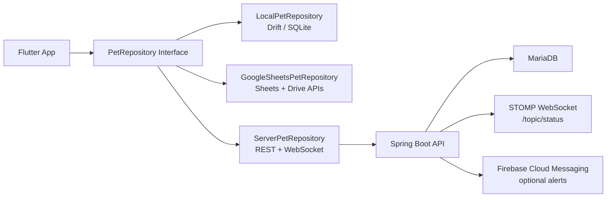
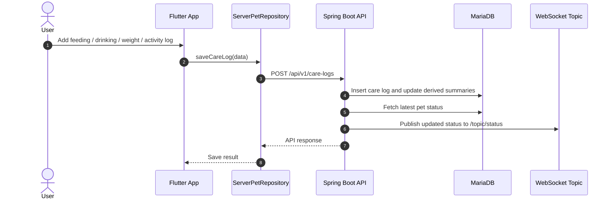

# Pet Health Tracker - System Architecture

This project is a pet health tracking application with a Flutter client and a Spring Boot backend. The current architecture supports three storage modes from the frontend:

- Local device storage with Drift / SQLite.
- Cloud synchronization through Google Sheets and Google Drive APIs.
- Server mode through the Spring Boot REST and WebSocket backend.

Earlier versions used Kafka and Redis for event ingestion and state timers. Those pieces have been removed from the active runtime and are now considered historical architecture.

---

## 1. High-Level Overview

The frontend selects the active repository through `storageSettingsProvider`. UI screens read and write through the shared `PetRepository` contract instead of directly depending on one storage implementation.

---

## 2. Frontend Architecture

### Flutter stack

- Flutter 3 / Dart 3.
- Riverpod for state management.
- Drift and sqlite3 for offline local storage.
- Google Sign-In, Google Sheets API, and Google Drive API for cloud storage.
- HTTP and STOMP WebSocket clients for server mode.
- `fl_chart` for health trend visualizations.

### Main frontend modules

- `lib/repositories/pet_repository.dart`: shared data contract.
- `lib/repositories/local_pet_repository.dart`: local SQLite implementation.
- `lib/repositories/google_sheets_pet_repository.dart`: Google Sheets implementation.
- `lib/repositories/server_pet_repository.dart`: backend API implementation.
- `lib/services/storage_settings_provider.dart`: active storage mode and Google account state.
- `lib/services/pet_status_provider.dart`: current dashboard status aggregation.
- `lib/screens/app_start_router.dart`: startup routing for onboarding, local mode, Google re-auth, and main app.

### Storage modes

| Mode | Purpose | Storage |
| --- | --- | --- |
| `local` | Offline-first personal use | Drift / SQLite on device |
| `googleSheets` | Family sharing and cloud sync | Google Sheets workbook |
| `server` | Backend-driven operation | Spring Boot + MariaDB |

---

## 3. Backend Architecture

### Backend stack

- Java 21.
- Spring Boot 3.2.5.
- MyBatis XML mappers.
- MariaDB.
- Caffeine cache.
- STOMP WebSocket.
- Firebase Admin SDK for optional FCM notifications.

### Main backend modules

- `CareLogController`: REST endpoints for care logs and current pet status.
- `CareLogPersistenceService`: synchronous persistence and daily summary updates.
- `HealthTrendController` / `HealthTrendService`: trend endpoints backed by MyBatis queries and Caffeine caching.
- `DehydrationAlertScheduler`: scheduled database-driven alert checks.
- `NotificationService`: FCM integration with mock fallback behavior.
- `WebSocketConfig`: STOMP endpoint `/ws-pet` and broker topic `/topic/status`.

---

## 4. Active Data Flow

### Saving a care log in server mode

### Saving a care log in local mode

The Flutter app writes directly to Drift tables, updates weight logs when needed, and recalculates the affected daily summary for the log date.

### Saving a care log in Google Sheets mode

The Flutter app appends rows to the `CareLogs`, `WeightLogs`, and `DailySummaries` sheets through Google APIs. Google Drive `capabilities/canEdit` is used to validate write permission when linking an existing spreadsheet.

---

## 5. Database Schema

The backend MariaDB schema is initialized from `backend/src/main/resources/schema.sql`.

Core tables:

- `care_logs`: raw feeding, drinking, weight, activity, and care events.
- `weight_logs`: normalized weight measurements for trend charts.
- `daily_health_summaries`: daily food, water, and average weight aggregates.

The local Drift database mirrors the same conceptual model for offline operation.

---

## 6. Historical Architecture Notes

Kafka, Redis, Redis key expiration listeners, and write-behind batch persistence were part of the earlier design. The current codebase has removed those dependencies and simplified runtime infrastructure to MariaDB only in `docker-compose.yml`.

When reading older task history, references to Kafka and Redis should be interpreted as completed historical work, not active runtime requirements.
