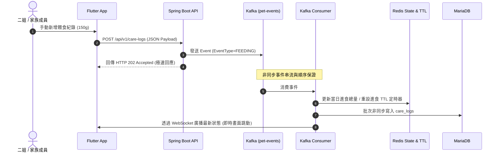

# 系統架構設計文件 (System Architecture)

本文件說明「寵物防禦性照顧健康防線系統 (Pet Health Check Project)」的架構、數據流、基礎建設配置與即時通知機制。

---

## 1. 架構概述 (Architecture Overview)

本系統為**事件驅動 (Event-driven)** 及**即時同步 (Real-time sync)** 的三層架構：

1. **客戶端 (Clients)**：包含 Flutter App (二姐及家人照護端) 以及智慧餵食器/飲水器 (IoT 設備)。
2. **後端 API 服務 (Spring Boot 3)**：
   - 提供 RESTful 端點以接收手動記錄與 IoT 遙測數據。
   - 整合 Apache Kafka 進行事件解耦與順序保證。
   - 整合 Redis 儲存即時狀態，並利用 Key TTL 觸發逾時未進食/未飲水之防禦性告警。
   - 提供 WebSocket (STOMP) 服務以向 App 推送最新的即時狀態。
   - 整合 Caffeine 快取歷史靜態與長週期數據，加快讀取速度。
3. **持久層 (MariaDB)**：存放歷史日誌、體重記錄等結構化數據。

---

## 2. 數據流向與事件管道 (Data Flow & Events)



---

## 3. 基礎設施配置 (Infrastructure Configuration)

### A. Redis 即時狀態機 (Redis State Machine)
Redis 存放寵物（約克夏 - 歐嚕嚕）的當下狀態。

*   **當前狀態 Hash (`pet:status:current`)**
    ```json
    {
      "lastWeightKg": "3.2",
      "todayWaterIntakeMl": "180",
      "todayFoodIntakeG": "120",
      "lastActiveTime": "2026-05-29T12:00:00Z"
    }
    ```
*   **飲水計時器 (`pet:health:water:timer`)**
    *   **類型**：String
    *   **TTL**：28800 秒 (8 小時)
    *   每次收到 `DRINKING` 事件時重設此 Key 與 TTL。
    *   若 8 小時內無人更新，Key 過期觸發事件，後端捕獲後發送 FCM 告警：「小狗已經 8 小時沒喝水囉！」。

### B. Apache Kafka 事件 (Kafka Event Schema)
*   **Topic**: `pet-events`
*   所有手動記錄、設備上報一律先注入此 Topic，確保高寫入吞吐量，並由 Consumer 保證資料寫入 MariaDB 的先後順序（防止多端寫入時時間戳記錯亂）。

---

## 4. 資料庫 Schema (Database Schema)

### A. 日常健康匯總表 (`daily_health_summaries`)
```sql
CREATE TABLE daily_health_summaries (
    id BIGINT AUTO_INCREMENT PRIMARY KEY,
    date DATE UNIQUE NOT NULL,
    total_water_intake_ml DOUBLE DEFAULT 0.0,
    total_food_intake_g DOUBLE DEFAULT 0.0,
    average_weight_kg DOUBLE DEFAULT 0.0,
    created_at TIMESTAMP DEFAULT CURRENT_TIMESTAMP,
    updated_at TIMESTAMP DEFAULT CURRENT_TIMESTAMP ON UPDATE CURRENT_TIMESTAMP
);
```

### B. 照護日誌表 (`care_logs`)
```sql
CREATE TABLE care_logs (
    id BIGINT AUTO_INCREMENT PRIMARY KEY,
    event_id VARCHAR(50) UNIQUE NOT NULL,
    event_type VARCHAR(20) NOT NULL,
    operator VARCHAR(50) NOT NULL,
    value DOUBLE,
    unit VARCHAR(10),
    note VARCHAR(255),
    event_timestamp TIMESTAMP NOT NULL,
    created_at TIMESTAMP DEFAULT CURRENT_TIMESTAMP
);
```

### C. 體重日誌表 (`weight_logs`)
```sql
CREATE TABLE weight_logs (
    id BIGINT AUTO_INCREMENT PRIMARY KEY,
    weight_kg DOUBLE NOT NULL,
    recorded_at TIMESTAMP NOT NULL,
    created_at TIMESTAMP DEFAULT CURRENT_TIMESTAMP
);
```

---

## 5. 本地快取策略 (Local Caching)

為了防止前端 App 在打開或重新整理時頻繁查詢 MariaDB 進而造成 DB 負擔，後端採用 **Caffeine (本地一級快取)**：
*   **快取對象**：
    1.  過去 12 週的體重變化趨勢數據。
    2.  過去 30 天的每日健康匯總 (`daily_health_summaries`)。
*   **過期策略**：
    - 寫入後 10 分鐘自動過期 (Write-expire)。
    - 當有新的體重或日誌寫入時，主動手動失效 (Evict) 對應的快取。
